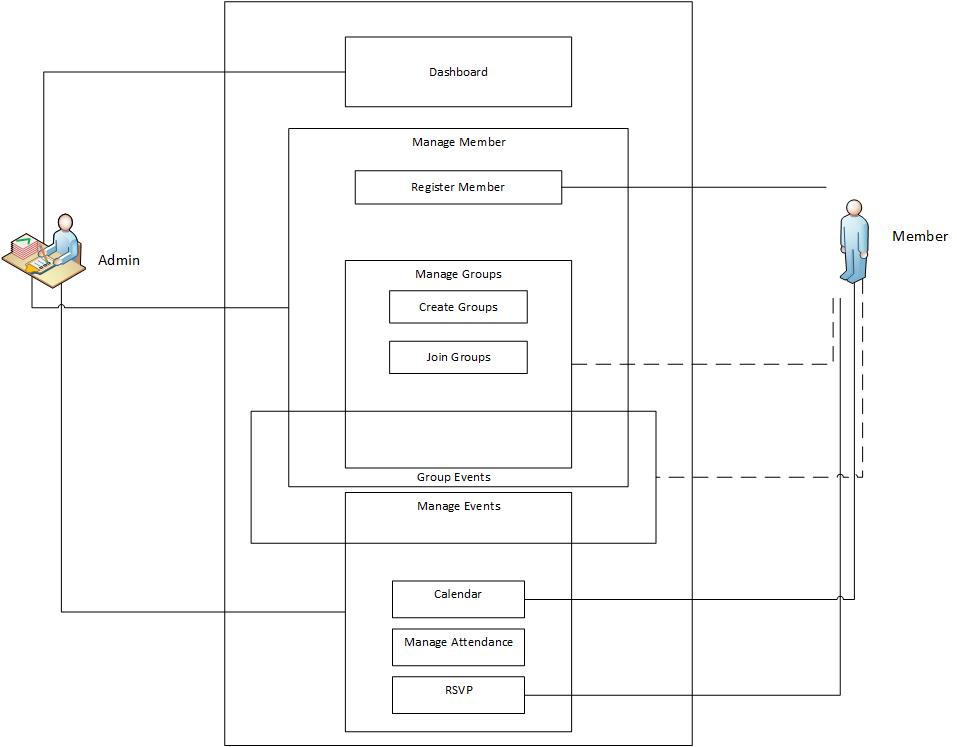
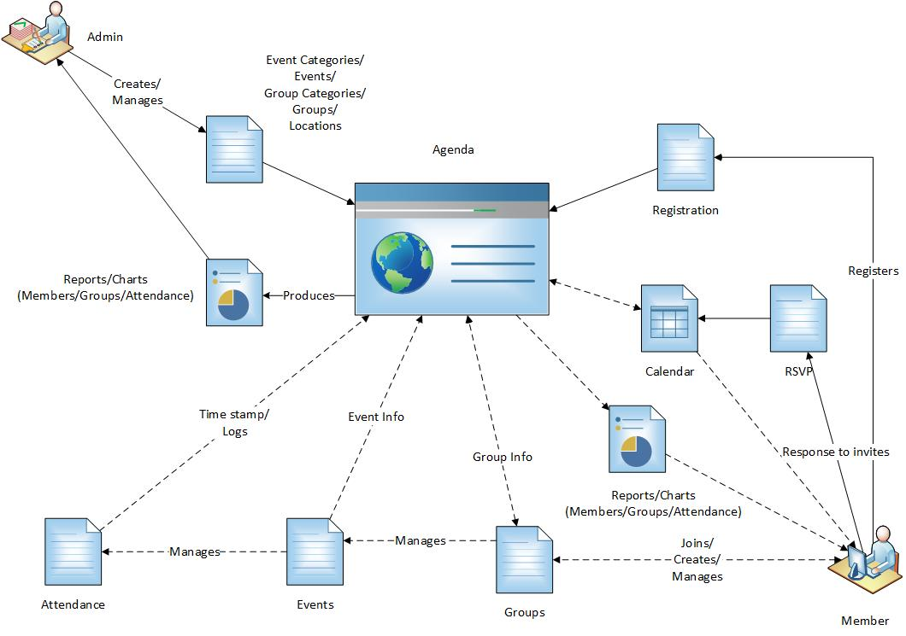
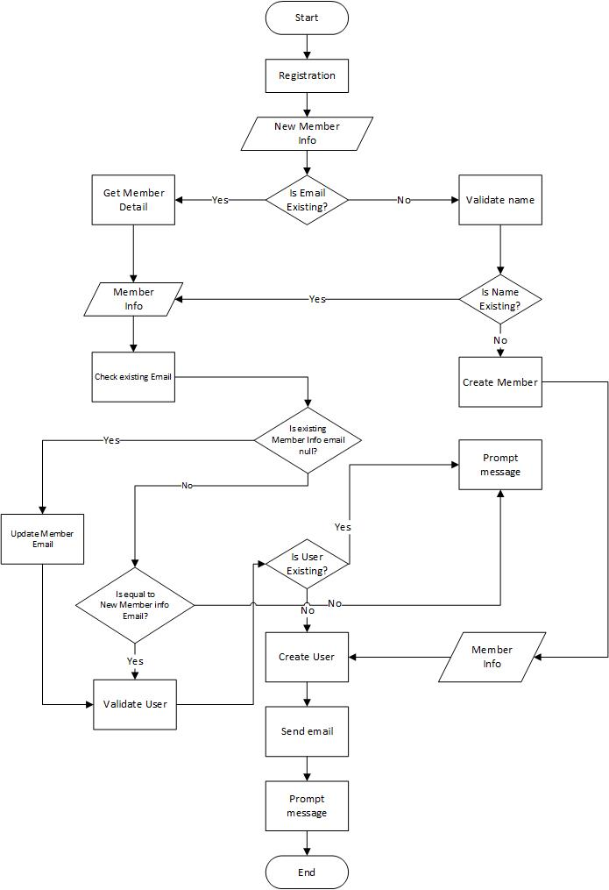
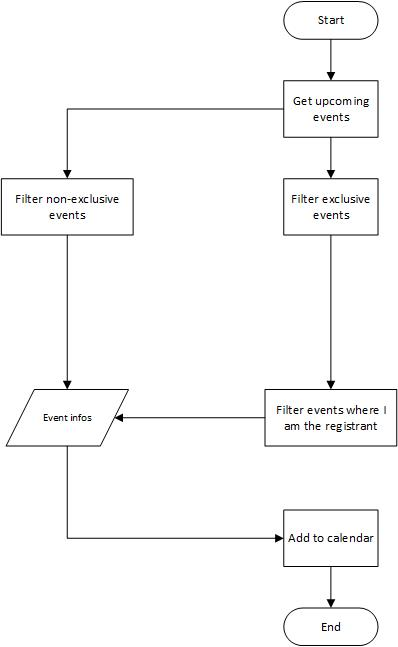

# Agenda BRD

Business Requirements Document

[[_TOC_]]

## Use Case Diagram

### Truth Table

(Y) Full; (L) Limited; (R) Read-only

| Module | Admin | User | Dev | Anonymous |
|---|---|---|---|---|
| Account | Y | Y | Y |  |
| Attendance | Y | L | L |  |
| Authentication |  |  |  | Y |
| Dashboard | Y |  |  |  |
| Event Category | Y | R | R | R |
| Event | Y | R | L |  |
| Group Category | Y | R | R | R |
| Location | Y | R | R | R |
| Member | Y |  | Y |  |

## Workflow Diagram

## Flow Charts

### Registration

### Calendar

